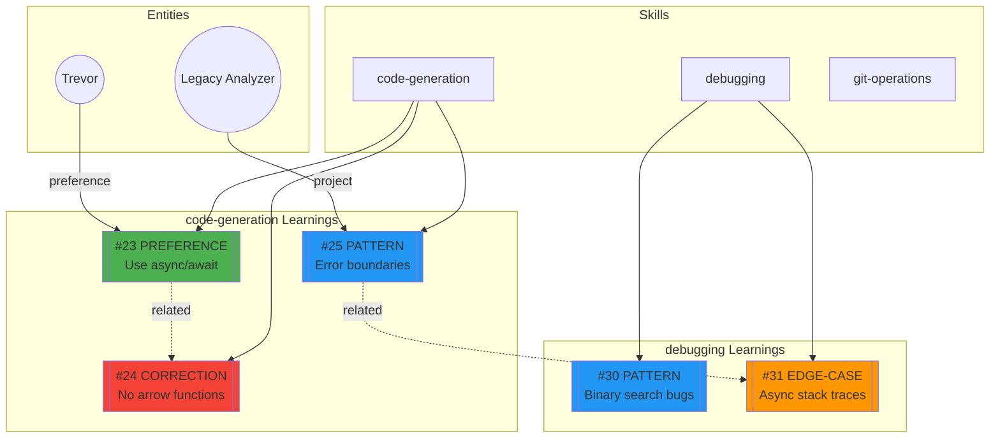
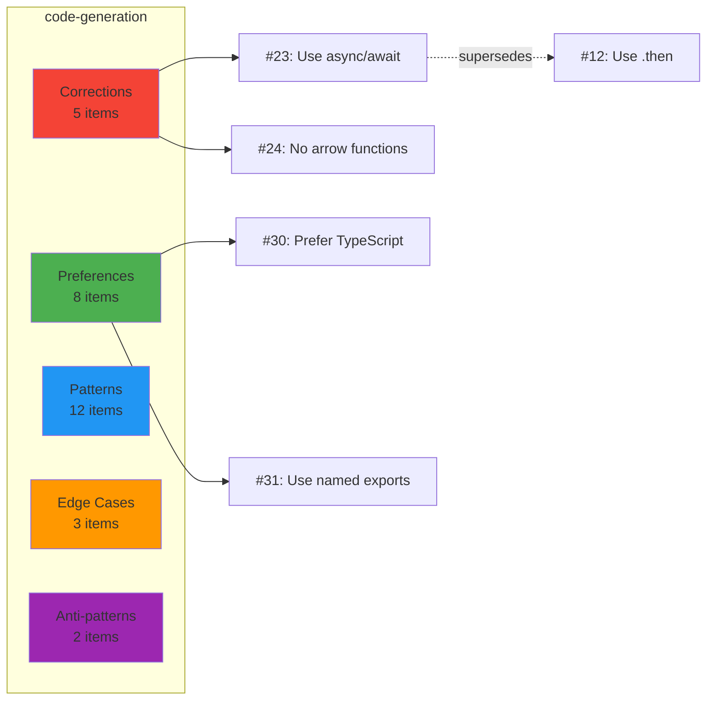
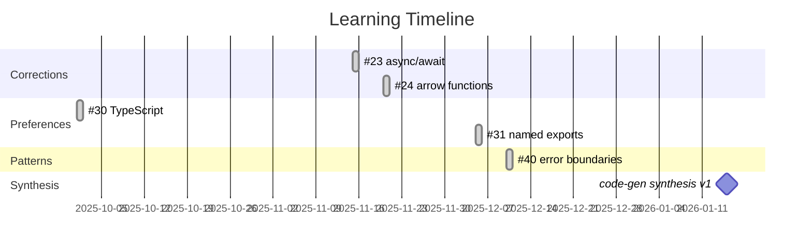
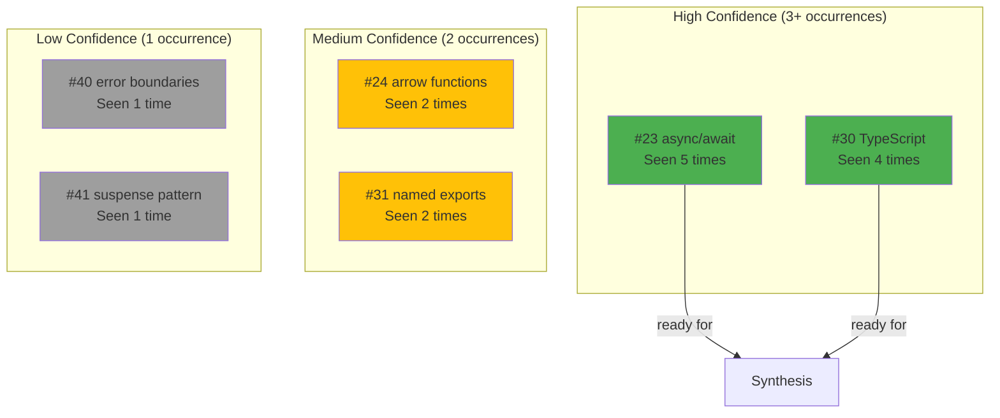
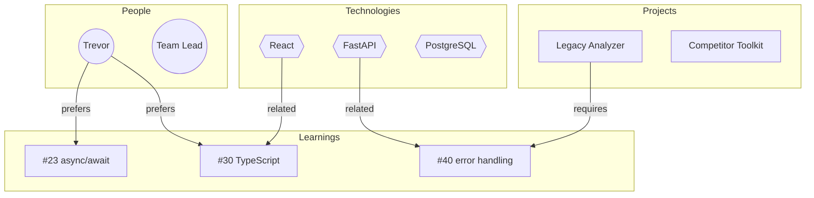

# Learning Visualization

This document describes how to visualize learning connections, patterns, and relationships.

## Overview

Visualizations help understand:
- How learnings connect to skills, projects, and entities
- Clusters of related learnings
- Knowledge gaps
- Learning evolution over time

## Graph Command

### Command: `/reflect graph [skill]`

Generates a visual map of learnings and their relationships.

### Workflow

```python
# Get learnings for skill (or all if no skill specified)
learnings = mcp__forgetful__execute_forgetful_tool("query_memory", {
  "query": "<skill-name or 'all'> learnings",
  "query_context": "Building learning graph visualization",
  "tags": ["skill-learning"],
  "k": 50,
  "include_links": true
})

# Get related entities
for learning in learnings:
    entities = mcp__forgetful__execute_forgetful_tool("get_entity_memories", {
      "entity_id": <linked_entity_id>
    })
```

### Mermaid Graph Output

Generate a Mermaid diagram showing relationships:



### Color Legend

| Color | Learning Type |
|-------|--------------|
| Green (#4CAF50) | Preference |
| Red (#f44336) | Correction |
| Blue (#2196F3) | Pattern |
| Orange (#FF9800) | Edge Case |
| Purple (#9C27B0) | Anti-pattern |

### Graph Variations

#### 1. Skill-Focused Graph

Shows all learnings for a specific skill:

```
/reflect graph code-generation
```



#### 2. Timeline Graph

Shows learning evolution over time:

```
/reflect graph --timeline
```



#### 3. Confidence Graph

Shows learning confidence based on repetition:

```
/reflect graph --confidence
```



#### 4. Entity Relationship Graph

Shows how entities connect to learnings:

```
/reflect graph --entities
```



## Text-Based Visualization

For environments without Mermaid rendering, provide ASCII visualization:

```
┌─ Learning Graph: code-generation ─────────────────────────────┐
│                                                               │
│  CORRECTIONS (5)              PREFERENCES (8)                 │
│  ├── #23 async/await          ├── #30 TypeScript              │
│  │   └── supersedes #12       │   └── confidence: HIGH        │
│  ├── #24 arrow functions      ├── #31 named exports           │
│  │   └── confidence: MED      │   └── linked to: #23          │
│  └── #25 strict types         └── #32 explicit returns        │
│                                                               │
│  PATTERNS (12)                EDGE CASES (3)                  │
│  ├── #40 error boundaries     ├── #50 null dates              │
│  │   └── linked to: #25       │   └── project: Legacy         │
│  ├── #41 suspense             └── #51 Windows paths           │
│  └── #42 lazy loading                                         │
│                                                               │
│  ANTI-PATTERNS (2)                                            │
│  ├── #60 N+1 queries                                          │
│  └── #61 sync in async                                        │
│                                                               │
│  ─────────────────────────────────────────────────────────────│
│  Legend: ─── direct link  ··· related  >>> supersedes         │
└───────────────────────────────────────────────────────────────┘
```

## Statistics Dashboard

Include summary statistics with visualizations:

```
┌─ Learning Statistics ─────────────────────────────────────────┐
│                                                               │
│  Total Learnings: 47        Active: 38    Synthesized: 9      │
│                                                               │
│  By Type:                                                     │
│  Corrections   ████████████░░░░░░░░  12 (26%)                 │
│  Preferences   ████████████████░░░░  16 (34%)                 │
│  Patterns      ██████████████░░░░░░  14 (30%)                 │
│  Edge Cases    ██░░░░░░░░░░░░░░░░░░   3 (6%)                  │
│  Anti-patterns ██░░░░░░░░░░░░░░░░░░   2 (4%)                  │
│                                                               │
│  By Confidence:                                               │
│  High (3+)     ████████░░░░░░░░░░░░   8 (17%)                 │
│  Medium (2)    ████████████░░░░░░░░  12 (26%)                 │
│  Low (1)       ██████████████████░░  27 (57%)                 │
│                                                               │
│  Top Skills:                                                  │
│  1. code-generation (18)  ████████████████████                │
│  2. debugging (12)        █████████████                       │
│  3. git-operations (8)    █████████                           │
│  4. communication (9)     ██████████                          │
│                                                               │
│  Health Score: 85/100                                         │
│  - No conflicts detected (+20)                                │
│  - 8 pending synthesis (-10)                                  │
│  - Recent activity (+15)                                      │
│  - Good distribution (+10)                                    │
│                                                               │
└───────────────────────────────────────────────────────────────┘
```

## Interactive Features

When running in an environment that supports it:

### Drill-Down

```
User: /reflect graph code-generation
[Shows overview graph]

User: Show me more about #23
[Expands to show full memory content, links, and history]
```

### Filtering

```
User: /reflect graph --type=correction --skill=code-generation
[Shows only corrections for code-generation skill]

User: /reflect graph --confidence=high
[Shows only high-confidence learnings across all skills]
```

### Export

```
User: /reflect graph --export=mermaid
[Outputs raw Mermaid code for use in documentation]

User: /reflect graph --export=json
[Outputs structured JSON for external visualization tools]
```

## Implementation Notes

1. **Mermaid Generation:** Build diagram strings programmatically from memory data
2. **Layout Optimization:** Group related nodes, minimize edge crossings
3. **Responsive:** Use text-based fallback when Mermaid unavailable
4. **Caching:** Cache graph data for quick re-rendering with filters
5. **Links:** Make memory IDs clickable where possible
