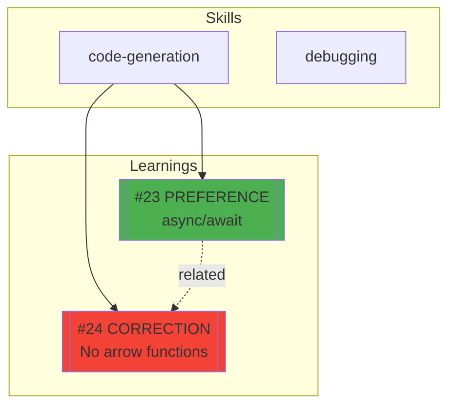

# Reflect Graph - Visualize Learning Connections

Generate visual map of learnings and their relationships.

## Usage

```text
/reflect graph           # All learnings
/reflect graph [skill]   # Specific skill
```

## Options

```text
/reflect graph --timeline      # Show evolution over time
/reflect graph --confidence    # Group by confidence level
/reflect graph --entities      # Show entity relationships
/reflect graph --type=correction  # Filter by type
```

## Workflow

### Step 1: Gather Data

```python
learnings = mcp__forgetful__execute_forgetful_tool("query_memory", {
  "query": "<skill or all> learnings",
  "query_context": "Building learning graph",
  "tags": ["skill-learning"],
  "k": 50,
  "include_links": True
})
```

### Step 2: Generate Mermaid Graph



### Step 3: Color Legend

| Color  | Type         |
| ------ | ------------ |
| Green  | Preference   |
| Red    | Correction   |
| Blue   | Pattern      |
| Orange | Edge Case    |
| Purple | Anti-pattern |

### Step 4: Text Fallback

```text
┌─ Learning Graph: code-generation ─────────────────────────────┐
│                                                               │
│  CORRECTIONS (5)              PREFERENCES (8)                 │
│  ├── #23 async/await          ├── #30 TypeScript              │
│  │   └── supersedes #12       └── #31 named exports           │
│  └── #24 arrow functions                                      │
│                                                               │
│  PATTERNS (12)                EDGE CASES (3)                  │
│  ├── #40 error boundaries     └── #50 null dates              │
│  └── #41 suspense                                             │
│                                                               │
└───────────────────────────────────────────────────────────────┘
```

## Reference

See `.claude/skills/reflect/VISUALIZATION.md` for detailed documentation.
